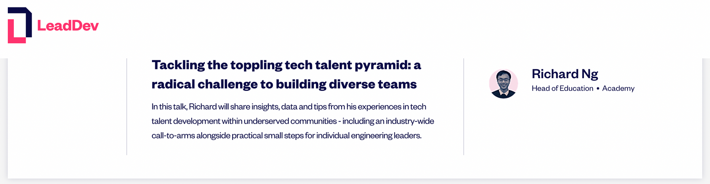
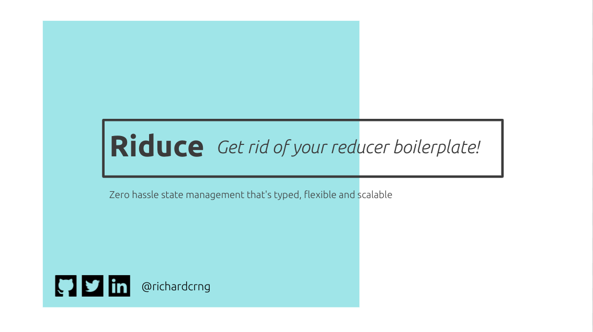

# Building [for the planet](#building-for-the-planet)... and [for play](#building-for-play)! <!-- omit in toc -->

👋 I'm Richard, co-founder and CTO of [greenworkx](https://greenworkx.org) (edtech / greentech).


🔗 **greenworkx: [site](https://greenworkx.org) | [Twitter](https://twitter.com/joingreenworkx) | [LinkedIn](https://www.linkedin.com/company/joingreenworkx)**

🔗 **Personal: [site](https://richard.ng/) | [Twitter](https://twitter.com/richardcrng) | [LinkedIn](https://www.linkedin.com/in/richardcrng/)**

---

In *general*, the best place to find out more about me is my [personal website](https://richard.ng/) - but it's geared towards a non-technical audience.

So, my GitHub profile `README` (hi there!) is where I talk a bit more about my technical work.

- [Building](#building)
  - [Building for the planet](#building-for-the-planet)
  - [Building for play](#building-for-play)
- [Open-source](#open-source)
  - [Riduce](#riduce)
- [Speaking](#speaking)
  - [UPCOMING: *Tackling the toppling tech talent pyramid* (LeadDev Berlin 2022)](#upcoming-tackling-the-toppling-tech-talent-pyramid-leaddev-berlin-2022)
  - [*Riduce: get rid of your reducer boilerplate!* (React Online Global Summit 2020)](#riduce-get-rid-of-your-reducer-boilerplate-react-online-global-summit-2020)

---

## Building

### Building for the planet

At [greenworkx](https://greenworkx.org), we’re building the talent portal, smart-matching AI and professional network for the 90% of green jobs that are skilled but accessible frontline trades.

📱 **[Try a demo!](https://demo.greenworkx.app)**

### Building for play

Outside work, board games are a big source of entertainment and relaxation for me.

I occasionally build quick online multiplayer implementations of games (that already exist), to allow for e.g. playing remotely with friends.

> ℹ️ **They're not documented especially well**, since the main use case is "me, Richard, playing with people I know and can quickly explain the rules to".
>
> However, *if you already know the underlying board/card game* and have played games remotely before, I *hope* that the UI/UX is sufficiently intuitive for you to pick it up.

Here are a few of them:
- [⛏️ Temple des Schreckens](https://github.com/richardcrng/tempel-des-schreckens)
- [🪳 Cockroach Poker](https://github.com/richardcrng/cockroach-poker)
- [⏲️ Two Rooms and a Boom](https://github.com/richardcrng/2r1b)

*Other board games that I like:*
- *[Scythe](https://boardgamegeek.com/boardgame/169786/scythe)*
- *[Race for the Galaxy](https://boardgamegeek.com/boardgame/28143/race-galaxy)*

---
## Open-source

### Riduce

> 👻 I'm the author of **[Riduce](https://github.com/richardcrng/riduce)**, an open-source library that replaces reducer boilerplate with two lines of code.
> 
> (Or: it *reduces* reducer boilerplate, and gets *rid* of it - hence, *Riducer* as a library name!)

Whether you're using `useReducer` or Redux, reducer boilerplate is tedious to learn, setup and maintain.

What if type-safe state management was quicker, easier and simpler?

[Riduce](https://github.com/richardcrng/riduce) is a library written to be:

- Strongly-typed, so your state stays predictable
- Trivial to scale as your state grows more complex
- Zero hassle, with just two lines of code...

... and one of the 2 lines to setup is an import.

```js
import riduce from 'riduce'

const [reducer, actions] = riduce(initialState)
```

That's it! Now you've got a type-safe reducer and arbitrary actions, with zero hassle.

***[Watch the talk](https://richardng.notion.site/Watch-the-talk-eb9283c1c51c4aa1881c8354625a273c) | [Read the docs](https://richardng.notion.site/richardng/Riduce-3cb629505a8d49279fe8848e1d564deb)***

___

## Speaking

### UPCOMING: *Tackling the toppling tech talent pyramid* (LeadDev Berlin 2022)



> **Tackling the toppling tech talent pyramid: a radical challenge to building diverse teams**
> In this talk, Richard will share insights, data and tips from his experiences in tech talent development within underserved communities - including an industry-wide call-to-arms alongside practical small steps for individual engineering leaders.

### *Riduce: get rid of your reducer boilerplate!* (React Online Global Summit 2020)



This talk is an introduction and live demo of [Riduce](#riduce), my open-source library to get rid of reducer boilerplate, that I gave at React Online Global Summit.