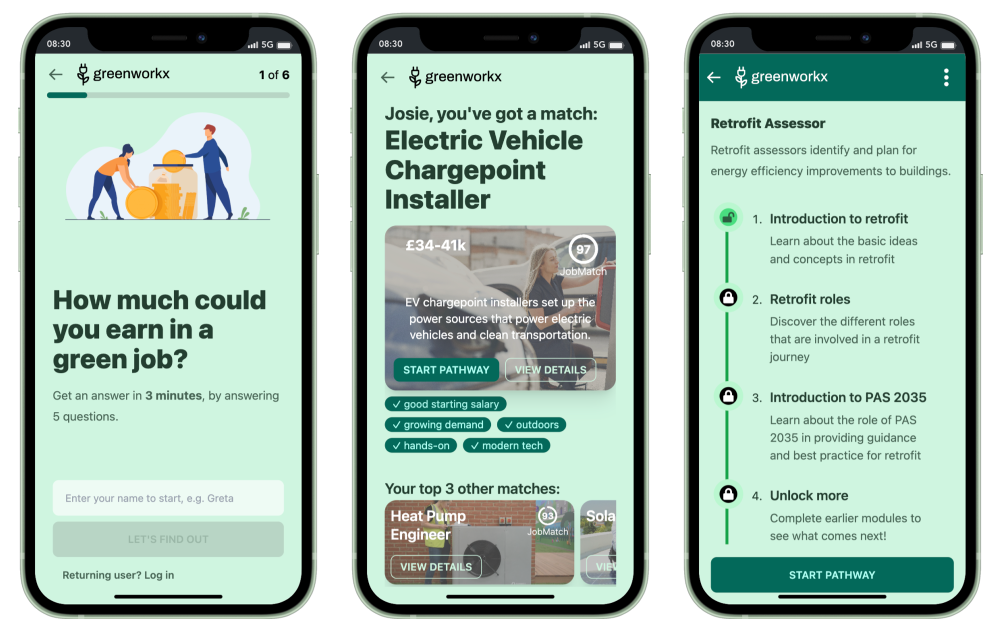

# EdTech, Climate, Future of Work, DE+I <!-- omit in toc -->

👋 I'm Richard, co-founder and CTO of [greenworkx](https://greenworkx.org) (EdTech for Climate).

[](https://youtu.be/79ZArGUW-dY)

🔗 **greenworkx: [site](https://greenworkx.org) | [Twitter](https://twitter.com/joingreenworkx) | [LinkedIn](https://www.linkedin.com/company/joingreenworkx)**

🔗 **Personal: [site](https://richard.ng/) | [Twitter](https://twitter.com/richardcrng) | [LinkedIn](https://www.linkedin.com/in/richardcrng/)**

---

In *general*, the best place to find out more about me is my [personal website](https://richard.ng/).

This GitHub profile `README` is a bit more focused on my technical work.

- [Work](#work)
  - [greenworkx](#greenworkx)
  - [Tech education x DE&I](#tech-education-x-dei)
- [Open-source](#open-source)
  - [Riduce](#riduce)
- [Speaking](#speaking)
  - [UPCOMING: *Tackling the toppling tech talent pyramid* (LeadDev Berlin 2022)](#upcoming-tackling-the-toppling-tech-talent-pyramid-leaddev-berlin-2022)
  - [*Riduce: get rid of your reducer boilerplate!* (React Online Global Summit 2020)](#riduce-get-rid-of-your-reducer-boilerplate-react-online-global-summit-2020)

---

## Work

### greenworkx

At [greenworkx](https://greenworkx.org), we’re building the talent portal, smart-matching AI and professional network for the 90% of green jobs that are skilled manual trades.



📱 **[Try the app!](https://greenworkx.app)**

### Tech education x DE&I

Prior to greenworkx, my career focus was tech education crossed with DE&I, e.g.:
- **Head of Education at Academy**, where I built a global tech training programme for cohorts that are 50% female, 60%+ minority ethnic backgrounds and 30% Black
- **Multiverse software engineering coach**, where I trained school leavers and career changers as software engineers for large enterprises 
- **teacher trainer with Code Your Future**, where I created training for the volunteers who taught CYF's refugee and asylum seeker trainees
- **Black Codher software engineering instructor** for two cohorts (40+) Black women learning full-stack software engineering

---
## Open-source

### Riduce

> 👻 I'm the author of **[Riduce](https://github.com/richardcrng/riduce)**, an open-source library that replaces reducer boilerplate with two lines of code.
> 
> (Or: it *reduces* reducer boilerplate, and gets *rid* of it - hence, *Riducer* as a library name!)

Whether you're using `useReducer` or Redux, reducer boilerplate is tedious to learn, setup and maintain.

What if type-safe state management was quicker, easier and simpler?

[Riduce](https://github.com/richardcrng/riduce) is a library written to be:

- Strongly-typed, so your state stays predictable
- Trivial to scale as your state grows more complex
- Zero hassle, with just two lines of code...

... and one of the 2 lines to setup is an import.

```js
import riduce from 'riduce'

const [reducer, actions] = riduce(initialState)
```

That's it! Now you've got a type-safe reducer and arbitrary actions, with zero hassle.

***[Watch the talk](https://richardng.notion.site/Watch-the-talk-eb9283c1c51c4aa1881c8354625a273c) | [Read the docs](https://richardng.notion.site/richardng/Riduce-3cb629505a8d49279fe8848e1d564deb)***

___

## Speaking

### UPCOMING: *Tackling the toppling tech talent pyramid* (LeadDev Berlin 2022)


> **Tackling the toppling tech talent pyramid: a radical challenge to building diverse teams**
> In this talk, Richard will share insights, data and tips from his experiences in tech talent development within underserved communities - including an industry-wide call-to-arms alongside practical small steps for individual engineering leaders.

### *Riduce: get rid of your reducer boilerplate!* (React Online Global Summit 2020)


This talk is an introduction and live demo of [Riduce](#riduce), my open-source library to get rid of reducer boilerplate, that I gave at React Online Global Summit.

***[Watch the talk](https://richardng.notion.site/Watch-the-talk-eb9283c1c51c4aa1881c8354625a273c) | [Read the docs](https://richardng.notion.site/richardng/Riduce-3cb629505a8d49279fe8848e1d564deb)***
